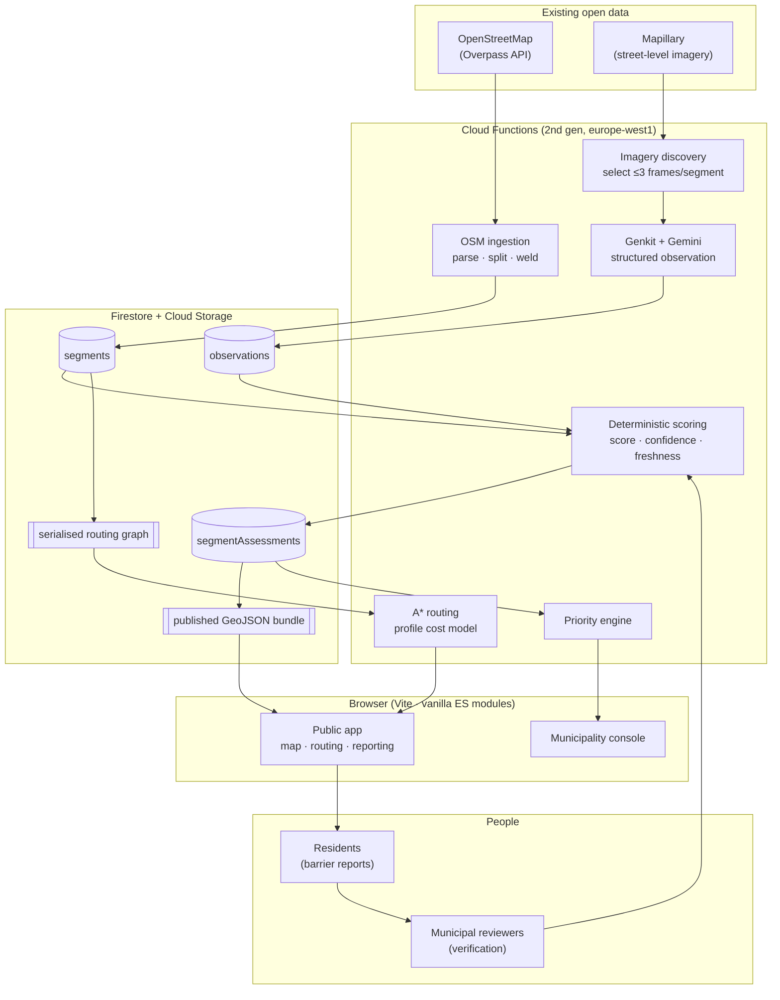

# Architecture

## The shape of the thing



## The one architectural decision that matters

**The scoring engine is shared source, not duplicated logic.**

`shared/` contains the accessibility scoring, evidence confidence, freshness,
classification, routing cost model, A* search and priority engine as pure,
dependency-free ES modules. The browser imports them through a Vite alias; the
Cloud Functions import a synced copy (`scripts/sync-shared.mjs`, run on install
and before every deploy, because `firebase deploy` only uploads the `functions/`
directory).

The alternative — a backend implementation and a frontend one — is how a system
ends up showing a user 72 while the database believes 68, and how a "Why this
score?" panel starts quietly lying. Here that class of bug cannot occur.

## Request paths

There are three, and which one a piece of data takes is a deliberate choice.

### 1. The map: one static file

The public map reads **one versioned GeoJSON bundle** from Cloud Storage, not
Firestore. For a few thousand segments, a Firestore-backed map would be a few
thousand document reads *per visitor*. The bundle is immutable per version, so
the browser cache does the rest, and a busy demo costs one CDN fetch.

Bundles are published explicitly (`publish_bundle` job) rather than on write:
publishing is the moment the municipality decides the current state is ready to
be seen.

### 2. Interactive reads: callable functions

Segment detail, routing, place search and report submission go through callable
Cloud Functions. They need server-side secrets, upstream rate limiting, or logic
that must not be client-trusted.

### 3. Console lists: Firestore directly

Reviewer-facing lists (reports, priority issues, live job progress) read
Firestore from the browser. The security rules already express exactly who may
read what; putting a function in front of them would duplicate that policy in a
second place where it could drift. **Writes always go through a callable**,
because writes need auditing.

## Long jobs

An OSM import of a district takes minutes. A callable that did the work would
tie the result to a browser tab staying open.

Instead the callable **creates a job document and returns immediately**. A
Firestore `onDocumentCreated` trigger picks it up with a nine-minute budget and
streams progress back into the same document, which the console watches live.

```
POST startIngestionJob  ──►  ingestionJobs/{id}  ──►  onIngestionJobCreated
      (returns in ~200 ms)         │                        │
                                   │◄───────────────────────┘
                            progress, errors, result
                                   │
                            console renders live
```

Jobs are idempotent. Every identifier is derived from OSM or Mapillary IDs, never
from insertion order, so re-running an import updates the same documents rather
than duplicating them. That is what makes "retry" a safe button.

## The ingestion pipeline in detail

**1 · Fetch.** Overpass, for a bounded region only. Never from a visitor's
browser — that would be both slow and an abuse of a donated public service.
`out body meta` gives us way tags, node references *and* the element's last edit
time, which is what dates our OSM-derived evidence.

**2 · Filter.** Keep pedestrian infrastructure and walkable roads. Drop
motorways. Drop a carriageway that declares `sidewalk=separate` on both sides —
its pavements are mapped as their own ways and counting both would double the
street.

**3 · Split at junctions.** A segment is the stretch of one way between two
junctions, not a whole street. Accessibility varies along a street, and a router
must be able to choose between the two sides of a road independently.

**4 · Weld endpoints.** Real OSM data routinely leaves a sidewalk and its
crossing a few centimetres apart. Left alone, the graph fragments into islands
and routing simply fails. Endpoints within 4 m are merged onto a canonical node
(the lowest OSM id in the cluster, so the mapping is stable across re-imports).
Only endpoints participate — welding interior vertices would invent shortcuts
that do not exist.

**5 · Report connectivity.** The import result states how many connected
components came out and what share of nodes the largest holds. An admin can see
immediately whether the network is routable or whether OSM has left it in
pieces.

## Evidence, and why observations are never rewritten

An **observation** is the atomic unit of evidence: one image, one analysis, one
set of structured findings, permanently attributed to its source.

Assessments are *recomputed from* observations. Observations themselves are
immutable. That is what makes it possible to change the scoring weights and
re-derive every assessment in the city without having lost what the system
originally saw — and what makes a validation label recorded last month still
meaningful today.

## Regions and versioning

Everything is scoped to a region, and three version counters move independently:

| Version | Bumped when | Effect |
|---|---|---|
| `graphVersion` | the routing graph is rebuilt | invalidates the routing cache |
| `bundleVersion` | the map bundle is published | new immutable URL for the map |
| `assessmentVersion` | the scoring logic changes | signals stored assessments need recomputing |
| `analysisVersion` | the AI prompt or schema changes | invalidates the observation cache |

The last two are the interesting pair. Bumping `analysisVersion` correctly
invalidates every cached observation, because results from two different
extraction contracts must not be mixed. Bumping `assessmentVersion` does not —
the observations are still good, only the arithmetic over them changed.

## Caching

| Thing | Where | Invalidated by |
|---|---|---|
| Routing graph | Cloud Function instance memory, keyed by `graphVersion` | rebuild |
| Map bundle | browser HTTP cache; immutable URL | new version |
| Bootstrap payload | in-memory, 2 minutes | reload |
| Geocoding results | Firestore, 30 days | expiry |
| AI observations | Firestore, keyed by source+model+version | version bump or explicit re-analysis |

## Frontend

No framework, deliberately. What a framework would buy — a component tree and
reactive updates — is not worth 40 kB on a mobile-first civic app whose heaviest
dependency is already a map engine. What it would cost is precise control over
the markup a screen reader receives, which in an accessibility product is the
wrong thing to trade away.

Instead: a small `el()` helper, a history-API router with lazy page modules, and
a persistent shell so the map instance survives tab changes.

First paint loads roughly 45 kB gzipped. MapLibre (275 kB gz) and the Firebase
services load only when a page actually needs them.

The router works from `window.location.pathname` minus Vite's `BASE_URL`. In
production that base is `/` and the subtraction is a no-op; it exists so the
same build can be served from a sub-directory for review without every path
resolving to a 404.

### Visual language

One typeface (Inter) plus a single script face used for exactly one accent word
on the home screen. A deep teal carries primary actions, a brighter blue marks
the AI and scanning affordances, and the four status colours are reserved: green,
amber, red and grey are never used for decoration anywhere in the interface, so
that a coloured line on the map means one thing and only one thing.

Status is never carried by colour alone. Every place a state appears — legend,
pill, route composition, console table — a glyph and a word travel with the hue.

Grey is a first-class state, not an absence. It appears in the legend beside the
other three rather than in a footnote, because "we do not have enough evidence"
is a result this system reports and a reader who does not see it listed will
assume the grey streets are simply bad ones.

Figures are rendered verbatim from the database. An unknown value is an em dash,
never a zero and never a bar at 0%; no trend arrow is drawn against a period the
pipeline does not retain a snapshot of. The dashboard shows no comparison it
cannot substantiate.

## Where the safety properties live

| Property | Enforced by |
|---|---|
| Clients cannot write accessibility data | `firestore.rules` — server-only, tested |
| Roles cannot be self-granted | custom claims, settable only via Admin SDK CLI |
| Privileged calls come from a real role | Firebase Auth custom claims, checked in every callable |
| A report cannot repaint a street | review workflow; assessment ignores unverified reports |
| The model cannot set a score | the schema has no score field; scoring is separate code |
| Spend is bounded | transactional daily ledger + per-job cap + dedup cache |
| Nothing is claimed without evidence | confidence gate before classification |
