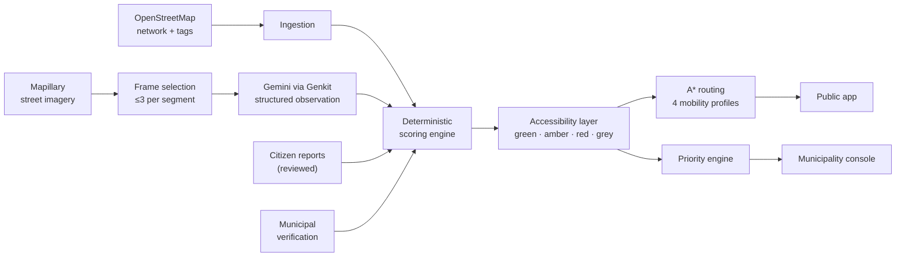

# AccessPafos AI — Technical Proposal

Pafos 2.0 Innovation Competition · Municipality of Pafos

---

## 1 · Problem

Pedestrian routing optimises distance and time. Neither answers the question that
decides whether a journey is possible for a wheelchair user, a person with
reduced mobility, an elderly resident or a parent with a pram: **is this route
usable?**

The obstacles are physical and specific — steps, missing dropped kerbs, high
kerbs, broken or cobbled surfaces, blocked or narrow pavements, crossings without
ramps, steep sections, temporary obstructions. They are visible in the street.
They are simply not in any database a router can query.

## 2 · Objectives

1. Produce a routable pedestrian accessibility layer for Pafos from data that
   already exists, without a street-by-street survey.
2. Make every accessibility claim traceable to the evidence that produced it.
3. Never assert accessibility that the evidence does not support.
4. Give the Municipality a ranked, explainable repair queue.
5. Keep it affordable enough to run on a student cloud account, and cheap enough
   for a small municipality to sustain.

## 3 · Solution overview

The central technical principle:

> **existing data → structured AI observations → deterministic scoring → routable graph**

## 4 · Architecture

| Layer | Choice | Why |
|---|---|---|
| Frontend | Vanilla JS ES modules, Vite, MapLibre GL JS | 45 kB gzipped first paint; full control over the markup a screen reader receives |
| Hosting | Firebase Hosting | SPA rewrites, global CDN, free tier |
| Backend | Cloud Functions v2, Node 22 ESM | Firestore triggers for long jobs; per-function secrets |
| Database | Cloud Firestore | real-time job progress; declarative security rules |
| AI | Genkit + Gemini Flash-Lite | constrained structured extraction with schema enforcement |
| Auth | Firebase Auth + custom claims | anonymous reporting; roles that cannot be self-granted |

**The one decision worth defending:** the scoring, confidence, freshness,
routing-cost, A* and priority engines live in `shared/` as pure ES modules,
imported unchanged by both the browser and the Cloud Functions. The number the
map shows and the number the backend computes come from the same lines of code.
A backend implementation plus a frontend one is how a system ends up displaying
72 while the database believes 68, and how a "Why this score?" panel starts
quietly lying.

Full detail: [ARCHITECTURE.md](ARCHITECTURE.md).

## 5 · Data sources

| Source | Used for | Licence |
|---|---|---|
| OpenStreetMap (Overpass) | pedestrian network, accessibility tags, public-service POIs | ODbL |
| Mapillary API v4 | street-level imagery metadata and thumbnails | CC BY-SA |
| OpenFreeMap / OpenMapTiles | basemap vector tiles | from OSM data |
| Nominatim | place search | ODbL |

Not used: pedestrian counts (we do not have them), commercial datasets, personal
data from third parties. See [DATA_SOURCES_AND_ATTRIBUTION.md](DATA_SOURCES_AND_ATTRIBUTION.md).

## 6 · OSM ingestion and the pedestrian graph

Bounded, admin-triggered Overpass queries — never from a visitor's browser.
Pedestrian ways are kept, motorways discarded, and carriageways declaring
separately-mapped pavements dropped so a street is not counted twice.

Ways are **split at junctions**: a segment is the stretch between two junctions,
not a whole street, because accessibility varies along a street and a router must
choose between the two sides of a road independently.

Endpoints within 4 m are **welded** onto a canonical node. Real OSM data
routinely leaves a sidewalk and its crossing centimetres apart; left alone the
graph fragments into islands and routing simply fails. Only endpoints
participate — welding interior vertices would invent shortcuts. The import result
reports the resulting connectivity, so an administrator sees immediately whether
the network is routable.

Identifiers derive from OSM IDs, never insertion order, which makes re-import
idempotent and "retry" a safe button.

## 7 · Imagery selection

A Mapillary sequence can hold eighty near-identical frames of one street.
Analysing all eighty would cost eighty times as much and add nothing.

At most three frames per segment, scored on proximity (35%), recency (30%),
viewing direction (20%) and Mapillary's quality score (15%), then a greedy
spatial spread — no two within 12 m, at most one per sequence on the first pass,
so the frames are genuinely independent views. Panoramas are skipped. Selection
is deterministic, so a cost estimate matches the run that follows it.

## 8 · AI analysis

A vision model reads one photograph and returns a fixed, enumerated schema of
what is physically visible. It never produces a score — the schema has no field
for one, the prompt forbids it, and the scoring engine is separate code that
never sees the model's prose.

The schema requires "I can see there is none" to be distinguished from "I cannot
see", and `unknown` is always available and explicitly preferred over a guess.

Four layers stand between the model and the map: Zod constraints at the boundary,
normalisation that coerces anything unrecognised to `unknown`, re-validation, and
a scoring engine that ignores findings it has no weight for. A schema failure is
retried once at temperature 0 and then recorded as failed — never patched up.

See [AI_METHODOLOGY.md](AI_METHODOLOGY.md).

## 9 · Scoring

Base 100, minus a weighted penalty per barrier, plus positives capped at 20.

Then the mechanism that took the most thought: **severe barriers impose a
ceiling**. A pavement with no dropped kerb but a beautiful surface scores 87 by
plain arithmetic — which is in the "accessible" band, and wrong. The ceiling caps
it at 62. Positives add points; they cannot climb over a ceiling. The ceiling
relaxes proportionally when the evidence is weak.

Findings from different sources are merged by identifier rather than stacked
(OSM and a photograph both seeing steps is one flight of steps). Contradictions
are resolved toward the better-evidenced side, and toward the barrier on a tie.

See [ACCESSIBILITY_SCORING.md](ACCESSIBILITY_SCORING.md).

## 10 · Three separate numbers

**Accessibility score** (0–100) — how usable the evidence suggests this is.

**Evidence confidence** (0–100) — how much to trust that. Built from how
informative the OSM tags are, how many usable images were analysed, whether
independent images agreed, and whether a human verified it. Deliberately **not**
the model's self-reported certainty: a language model's confidence in itself is
not evidence.

**Freshness** — recent (<1y), ageing (1–3y), out of date (>3y). Discounts
confidence, penalises routing, always shown with the capture date, re-evaluated
nightly.

## 11 · The grey rule

Classification happens **only** when confidence reaches 45. Below that the
segment is "not enough evidence" — grey and dashed — whatever its provisional
score. Confidence is checked *before* the score: 100 with confidence 5 is grey.

The calibration is written down as a table in `shared/config.js`, so it can be
argued with:

| Evidence | Confidence | Result |
|---|---:|---|
| 1 good photograph | 17 | grey |
| 2 good photographs, agreeing | 49 | classified |
| 2 good photographs, contradicting | 31 | grey |
| OSM: surface only | 13 | grey |
| OSM: surface + smoothness + width + kerb + incline + tactile | 52 | classified |
| the same, but three years old | 39 | grey |

## 12 · Routing

Cost in equivalent metres: length × classification multiplier + named barrier
penalties + an uncertainty penalty for unassessed segments + a freshness penalty
for stale ones. Every term is non-negative and the multiplier is never below 1,
so the straight-line A* heuristic stays admissible and the result is genuinely
optimal rather than merely feasible.

The wheelchair profile **refuses** steps rather than penalising them. With a
large-but-finite penalty a router facing no good option eventually routes
*through* the staircase, because some path beats no path. Refusal produces "no
accessible route found" plus the shortest walk, so the user can see what stands
in the way. Saying "I cannot get you there" is a better answer than a route that
does not work.

Three routes always come back together — recommended, balanced, shortest — with
distance, time, accessibility score, confidence, composition by classification,
unassessed percentage, barriers avoided, extra distance, and a "why this route?"
explanation rendered from translated keys rather than model prose.

See [ROUTING.md](ROUTING.md).

## 13 · Citizen reporting

Three steps on one phone screen: category, location (map moves under a fixed
crosshair — far easier one-handed than dragging a pin), optional photograph.

Anonymous authentication gives the report an owner without asking anyone to make
an account. On submission it is matched to a pavement segment, checked against
nearby open reports for duplicates, and — if it carries a photograph — analysed,
**for the reviewer's benefit only**.

A report cannot repaint a street. It is evidence a human will look at. Only after
verification does it contribute, and then at 0.85 weight rather than full.

## 14 · Municipality console

Overview, map with a verification drawer, report review queue, priority queue,
coverage, ingestion, validation, settings and audit log.

**Priority** is deterministic and itemised: severity (30), no accessible
alternative (20), nearby public services (15), safety impact (10), confirmed
resident reports (10), evidence confidence (8), freshness (7), plus a capped
municipal boost. Every factor is computed from data the system holds — and there
is deliberately **no footfall factor**, because we do not have pedestrian counts
for Pafos and a plausible-looking estimate would make the ranking unfalsifiable.

The "no accessible alternative" factor is computed by re-routing between the two
ends of the barrier with that segment removed. No way round at all is the worst
case, and it is treated as such.

**Coverage** is measured in metres of pedestrian network, not segment counts — a
hundred five-metre crossing stubs are not the same amount of city as a hundred
long streets — and reports the unknown share as prominently as the known one.

## 15 · Validation

Reviewers record ground truth for segments; the system freezes its own belief at
the moment of labelling so a later recomputation cannot flatter a historical
score. Agreement is computed only from those labels and always shown with the
sample size; below thirty it is marked indicative.

Optimistic errors — claiming a street is better than it is — are counted
separately, because they are the failures that can strand someone.

The screen suggests the **lowest-confidence** classified segments for labelling.
A sample drawn from where the system is most confident would flatter it.

## 16 · Security and privacy

Authoritative accessibility data is server-owned: no client, at any role, can
write a segment, an assessment, an observation or an audit entry. Roles are
custom claims settable only via the Admin SDK, and checked inside every
privileged callable. Citizen photographs are never public. Report photographs from rejected reports
are deleted after 30 days.

Location never leaves the browser. Analytics are opt-in, allowlisted by event
name, and filtered against a blocklist that strips anything resembling a
coordinate, an identifier or a query.

See [SECURITY.md](SECURITY.md) and [PRIVACY.md](PRIVACY.md).

## 17 · Cost control

Four independent limits: three frames per segment, a per-job cap, a per-day cap
enforced by a **transactional** Firestore ledger (Cloud Functions scale out; an
in-memory counter is no limit at all), and a deduplication key over source, model
and analysis version so identical evidence is never paid for twice.

Bulk analysis never starts automatically; an administrator sees the exact call
count before the button means anything. No scheduled function calls a model.

The public map reads one static GeoJSON bundle rather than thousands of Firestore
documents — the difference between a map that is free to serve and one that is
not.

See [COST_CONTROL.md](COST_CONTROL.md).

## 18 · Accessibility of the application itself

An accessibility product that is not itself accessible would be a poor argument
for its own thesis. Target WCAG 2.2 AA:

- semantic HTML, one `h1` per view, landmark regions
- skip link; `main` focused and route changes announced on navigation
- visible `:focus-visible` outlines throughout
- dialogs and bottom sheets are real modals: focus trapped, Escape closes, focus
  restored to the opener
- `aria-live` regions for route results, toasts and status changes
- 46 px minimum touch targets; 16 px inputs so iOS does not zoom on focus
- `prefers-reduced-motion` and `prefers-contrast` honoured, plus an in-app
  motion toggle
- **colour is never the only channel**: glyphs in the legend, dashed lines for
  unverified segments, a text label beside every status pill
- full English and Greek, 340 keys, with a language switch and browser detection
- `100dvh` and safe-area insets for notched devices

## 19 · Testing

337 automated tests, no network required.

| Suite | Covers |
|---|---|
| Unit (200) | geodesy, OSM tag interpretation, scoring, confidence, freshness, classification, aggregation, routing cost, A*, route planning, priority, duplicates, the assessment pipeline |
| Integration (78) | Overpass fixture → graph → assessment → routing end to end; simulated model outputs including adversarial ones; frame selection over an 80-frame sequence; CSV quoting; the AI schema contract |
| Component (59) | rendering in a DOM: ARIA on meters and dials, focus trapping, the segment evidence sheet in both languages, and an assertion that no untranslated key ever reaches the screen |
| Security rules | every collection × every role, plus report validation and owner scoping (requires the emulator) |

Several of these tests found real defects during development — including
`not_visible` being counted as informative evidence, which would have inflated
confidence, and a security rule that made owner-scoped deletes impossible.

## 20 · Limitations

- Mapillary coverage is uneven; streets without it stay grey.
- A photograph is one moment. A pavement clear in 2024 may be blocked today.
- Widths and gradients cannot be measured from an uncalibrated photograph, so the
  system reports categories, never numbers.
- OSM accessibility tagging is thin in most cities, Pafos included. The project
  surfaces that gap rather than papering over it.
- No accuracy figure is published until it has been measured.
- Not an accessibility audit; no regulatory standing.

## 21 · Scalability

Region-scoped throughout: a second municipality is a bounding box and an import
job. The AI cost is one-off per image and cached forever; recalculating a whole
city's assessments after a scoring change costs nothing.

The realistic constraint is not compute — it is imagery coverage, which improves
as Mapillary grows and as a municipality contributes its own captures.

## 22 · Future work

Ordered by value per unit of effort:

1. **Municipal imagery contribution** — a council vehicle with a phone mount
   covers a district in an afternoon and improves every segment it passes.
2. **Importing an existing municipal accessibility survey** as a verification
   source, if one exists.
3. **Indoor and building-entrance accessibility** for public buildings.
4. **Temporal reporting** — "blocked most weekday mornings" is a different fact
   from "blocked", and residents already know which is which.
5. **Public-transport integration**, so a journey can span a bus.
6. **Feeding verified findings back to OpenStreetMap**, which would make the
   whole commons better rather than only this application.
